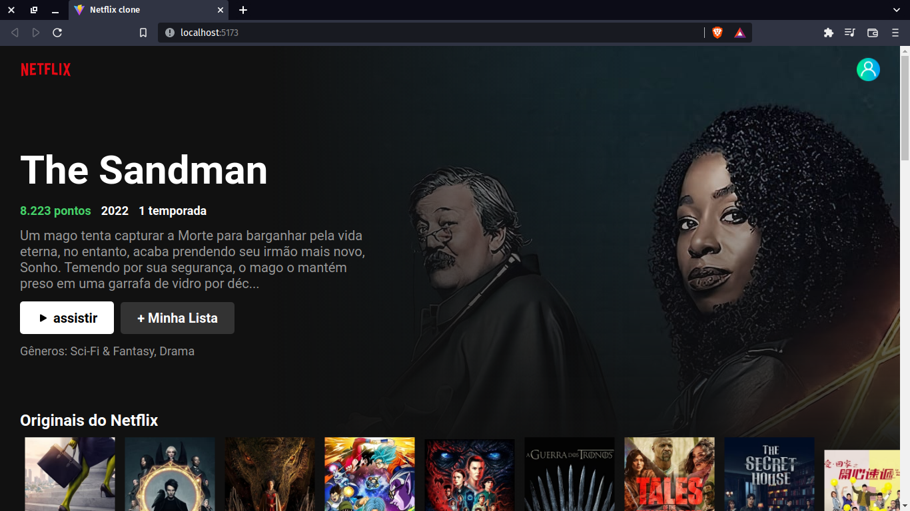
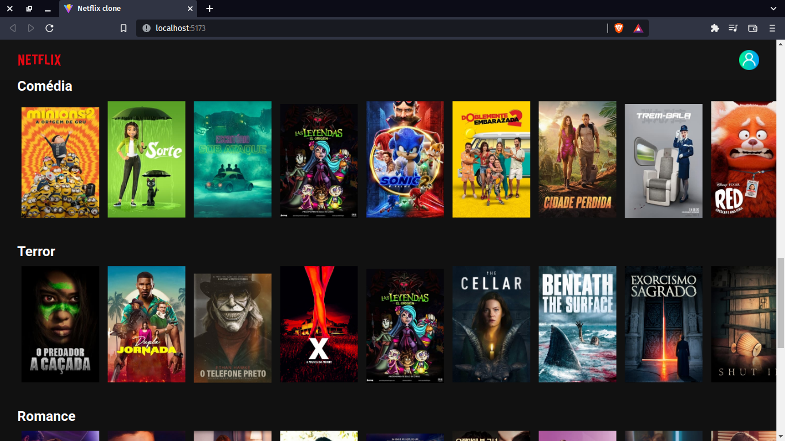

# Clone UI da NetFLix

Projeto feito durante o acompanhamento da live do canal [Bonieky Lacerda](https://www.youtube.com/watch?v=tBweoUiMsDg&t=906s), onde foi tratados assuntos como o desenvolvimento de uma interface de usuário para um aplicativo de streaming de vídeos. Responsividade, consumo de API rest, componentes dentro outros.

## Como usar !

Para poder rodar o clone da interface do NetFLix, é necessário ter a KEY ou chave da API para poder fazer as requisições para o servidor que contem as imagens e os demais detalhes dos filmes.
[API das imagens](https://www.themoviedb.org/documentation/api?language=pt-BR).  

Após isso, basta copiar baixar o projeto em sua máquina, abrir o arquivo localizado em src/shared/services/api/ e abrir o arquivo api.js. e editar a chave da API. Colocando a sua chave na variável API_KEY.

## Amostração do projeto

## Copyright

&copy; Direitos das imagens [NetFlix](https://www.netflix.com/br/).  
&copy; Direitos dos dados [Themoviedb](https://www.themoviedb.org/?language=pt-BR).  
&copy; Mentor [Bonieky Lacerda](https://www.youtube.com/watch?v=tBweoUiMsDg&t=906s).
